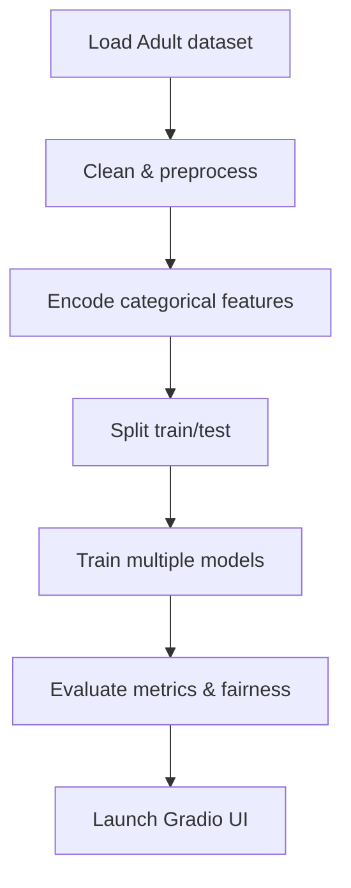

# Income Prediction Project

This repository contains a full workflow for predicting whether an individual from the UCI Adult census dataset earns more than \$50K per year. The notebook cleans the data, engineers features and evaluates several classifiers while tracking fairness metrics. The project culminates in an interactive Gradio demo for trying the model on custom inputs.

- `Lubinsky_Final.ipynb` – a Jupyter notebook that loads the dataset, performs preprocessing, trains multiple models (logistic regression, SVM, random forest, gradient boosting and XGBoost), assesses performance with bootstrap confidence intervals and examines fairness with `fairlearn` and interpretability with SHAP. The final cells build a Gradio interface for making predictions.

## Workflow

The overall workflow is illustrated below:

## Usage

1. Install the required Python packages: `pandas`, `scikit-learn`, `numpy`, `matplotlib`, `xgboost`, `shap`, `gradio` and `fairlearn`.
2. Open `Lubinsky_Final.ipynb` in Jupyter and run all cells sequentially. The notebook downloads the dataset, trains the models and finally starts the Gradio app.
3. Once the interface launches (usually at http://127.0.0.1:7860), adjust the controls and click **Submit** to see the probability that income exceeds \$50K.
