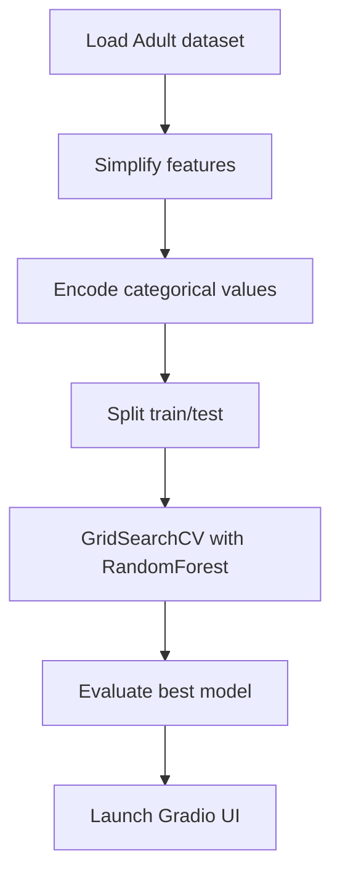

# Income Prediction Project

This project uses the UCI Adult dataset to train a Random Forest classifier that predicts whether a person makes over $50K per year. To help mitigate bias, the training features exclude sensitive attributes such as race and sex, and fairness constraints are enforced using the `fairlearn` library. The repository contains:

- `CSC_Final_Use(2).py` – a Python script that loads the data, simplifies certain categorical features, encodes them, performs a grid search over hyperparameters, and provides an interactive Gradio app for making predictions.
- `CSC_Final_Use(2).ipynb` – a companion notebook implementing a similar pipeline using a `ColumnTransformer` and showing feature importance.

## Workflow

The overall workflow is illustrated below:

## Usage

1. Install the required Python packages (pandas, scikit‑learn, numpy, gradio, matplotlib, fairlearn).
2. Run `python CSC_Final_Use(2).py` to execute the script and launch the Gradio application.
3. Alternatively, open `CSC_Final_Use(2).ipynb` in Jupyter to explore the notebook version.

After running the script, open the URL printed in the console (usually http://127.0.0.1:7860) in your browser. Fill in Age and select your Education, Marital Status, Occupation, Race and Sex from the drop-downs, then click "Predict" to see the probability that income exceeds $50K.
