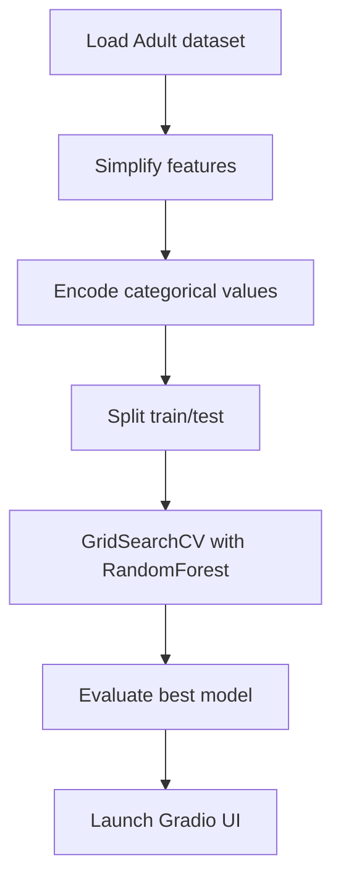

# Income Prediction Project

This project uses the UCI Adult dataset to train a Random Forest classifier that predicts whether a person makes over $50K per year. The repository contains:

- `CSC_Final.txt` – a Python script that loads the data, simplifies certain categorical features, encodes them, performs a grid search over hyperparameters, and provides an interactive Gradio app for making predictions.
- `CSC_Final.ipynb` – a companion notebook implementing a similar pipeline using a `ColumnTransformer` and showing feature importance.

## Workflow

The overall workflow is illustrated below:

## Usage

1. Install the required Python packages (pandas, scikit‑learn, numpy, gradio, matplotlib).
2. Run `python CSC_Final.txt` to execute the script and launch the Gradio application.
3. Alternatively, open `CSC_Final.ipynb` in Jupyter to explore the notebook version.

The Gradio interface allows you to input demographic details and returns the predicted income category with a probability.
